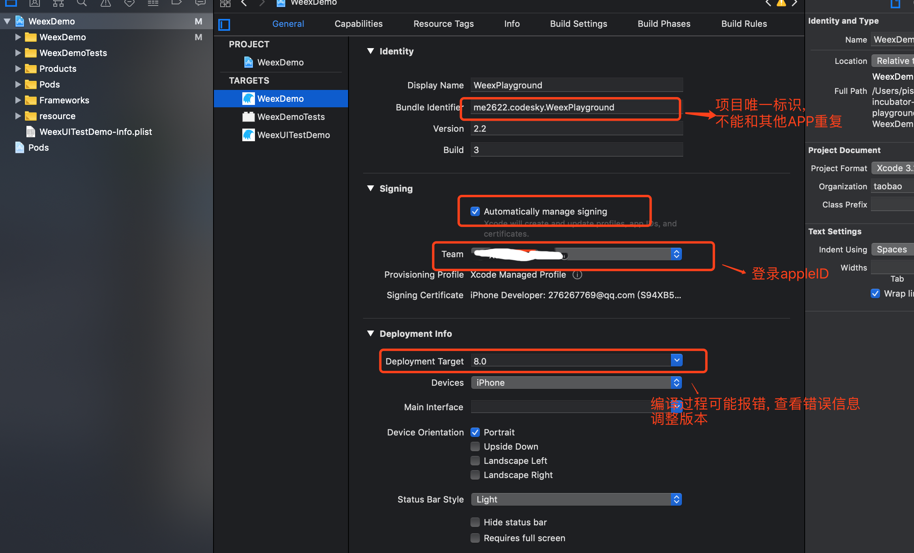
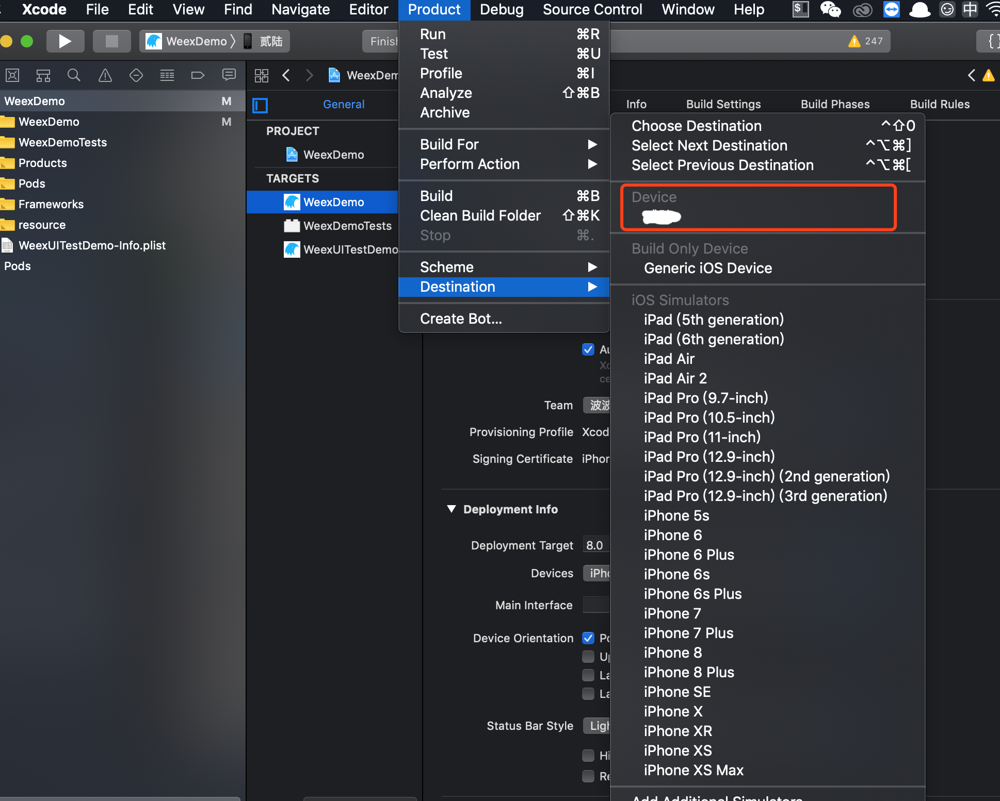

## weex 中集成 F2 实现图表功能
> 环境
- macOS: `v10.14.1`
- nodeJS: `v8.12.0`
- npm: `v6.4.1`
- weex: `v1.3.11`
- WeexSDK: `0.20.1`
- WeexGcanvas: `0.1.2`
- F2: `3.1.0`

> 运行工程

```
// 进入工程
cd weeTest

// 安装 npm 包
npm install

// 安装 ios 插件
cd platforms/ios
pod install

// 运行模拟器
weex run ios
```

> 坑点
- App store 目前下载的 weex playground 不集成 Gcanvas。所以直接下载的无法展示.<br>
  编译包含制定插件的 weex playground
    1. 下载 weex 项目
        ```
        git clone https://github.com/apache/incubator-weex        
        ```
    2. 安装插件
        ```
        cd incubator-weex/ios/playground
        vim Podfile
        ```
       在 `Podfile` 中添加代码
        ```
        pod ‘WeexGcanvas'
        pod 'WeexPluginLoader'
        ```
       安装插件
       ```
       pod install
       ```
    3. 用 xcode 打开项目(项目路径 incubator-weex/ios/playground)
    4. 配置项目
       
    5. 选择真机
       
    6. 点击编译
    7. 手机上信任程序: 设置 -> 通用 -> 设备管理 -> 点击属于自己账户的开发者, 选择信任
    8. [参考资料](https://zhuanlan.zhihu.com/p/25227030)

